<div align="center">

# AI Playbook

**Battle-tested frameworks for thinking with AI -- not just talking to it.**

Distilled from 70+ real-world projects. 11 reasoning frameworks, 8 philosophical archetypes, 48 task prompts, and drop-in Claude Code skills.

[](tasks/vibecoding/)
[](frameworks/)
[](claude-code/)
[](tasks/)
[](templates/)
[](LICENSE)

**If this helps you think better with AI, [give it a star](../../stargazers) -- it helps others find it too.**

</div>

---

## Quick Start (60 seconds)

**Option A: Claude Code skill** -- copy one file, get a new capability:
```bash
# Copy a skill into your project
mkdir -p .claude/skills/adhd-optimize
cp ai-playbook/claude-code/skills/adhd-optimize.md .claude/skills/adhd-optimize/SKILL.md

# Use it
# /adhd-optimize "Your verbose, rambling prompt that could be better"
```

**Option B: CLAUDE.md config** -- upgrade your entire project:
```bash
cp ai-playbook/claude-code/examples/claude-md-adhd.md CLAUDE.md
```

**Option C: Pick a framework** and paste it into any AI conversation:
```
🎯 TASK: Implement user auth
📋 CONTEXT: Cloudflare Workers, JWT, D1 database
✅ OUTPUT: Working auth middleware with tests
⚠️ CONSTRAINTS: No session storage, stateless only
```
*That's the [ADHD Prompting Framework](frameworks/adhd-prompting/) -- it works everywhere.*

---

## The Vibecoding System

The flagship differentiator. Eight archetypal personas, each a fusion of 3+ wisdom traditions. Not prompt templates -- philosophical lenses that change how the AI thinks.

<div align="center">

| | Archetype | Essence | Fused From |
|---|-----------|---------|------------|
| 🏰 | **Clarity Architect** | Structural simplicity | Stoic Guardian + Occam's Minimalist + Cognitive Load Theory |
| 🪞 | **Direct Mirror** | Immediate insight | Zen Mirror + Phenomenological Observer + Mindful Observer |
| 🎵 | **Flow Director** | Dynamic harmony | Jazz Director + Flow Guide + Wabi-Sabi Craftsperson |
| 🧱 | **Truth Builder** | Foundational rigor | First Principles Architect + Empiricist + Falsification Challenger |
| 🔮 | **Pattern Synthesizer** | Holistic integration | Systems Synthesizer + Pattern Analyst + Gestalt Weaver |
| 🦉 | **Wisdom Guide** | Ethical integration | Confucian Guide + Circle Keeper + Prudent Synthesizer |
| 📐 | **Creative Organizer** | Aesthetic function | Bauhaus Architect + Swiss Information + Ma Gardener |
| 🧭 | **Purpose Seeker** | Authentic discovery | Sufi Seeker + Existential Clarifier + Socratic Investigator |

</div>

**How to pick:** Choose what resonates, not what sounds most useful. Combine two for complex problems.

| Situation | Try |
|-----------|-----|
| Technical complexity | Truth Builder + Pattern Synthesizer |
| Creative exploration | Flow Director + Purpose Seeker |
| Overwhelming information | Clarity Architect + Creative Organizer |
| Unclear objectives | Direct Mirror + Wisdom Guide |
| Ethical considerations | Wisdom Guide + Purpose Seeker |

[Full archetype documentation](tasks/vibecoding/) -- each includes philosophical foundations, system prompts, and fusion combination guides.

---

## Which Framework Should I Use?

```mermaid
flowchart TD
    START{What are you trying to do?} --> OPTIMIZE[Optimize a prompt]
    START --> ANALYZE[Analyze something deeply]
    START --> BUILD[Build or design something]
    START --> REASON[Reason through a problem]
    START --> PERSONA[Change how the AI thinks]

    OPTIMIZE --> ADHD[**ADHD Prompting**<br/>40-60% token reduction<br/>works everywhere]
    OPTIMIZE --> CE[**Context Engineering**<br/>long conversations<br/>context window design]

    ANALYZE --> METRICS[**METRICS+**<br/>5-layer analysis<br/>cross-domain insights]
    ANALYZE --> EGAF[**EGAF**<br/>global analysis<br/>cultural adaptability]

    BUILD --> FRACTAL[**Fractal**<br/>macro/meso/micro<br/>architecture decisions]
    BUILD --> MCPA[**MCPA**<br/>agent coordination<br/>multi-agent systems]

    REASON --> ECARLM[**ECARLM**<br/>state evolution<br/>complex reasoning chains]
    REASON --> ELSF[**ELSF**<br/>logic-based<br/>formal derivation]
    REASON --> RV2[**Reasoning v2**<br/>structured verification<br/>general reasoning]

    BUILD --> PROD[**Production AI Patterns**<br/>grounding + hallucination prevention<br/>agentic systems]
    BUILD --> GOV[**Agent Governance**<br/>authority tiers + constraints<br/>autonomous agents]

    PERSONA --> VIBE[**Vibecoding**<br/>8 archetypes<br/>philosophical lenses]

    style ADHD fill:#4CAF50,color:#fff
    style VIBE fill:#9C27B0,color:#fff
    style FRACTAL fill:#2196F3,color:#fff
    style METRICS fill:#FF9800,color:#fff
    style CE fill:#4CAF50,color:#fff
    style MCPA fill:#2196F3,color:#fff
    style ECARLM fill:#F44336,color:#fff
    style EGAF fill:#FF9800,color:#fff
    style ELSF fill:#F44336,color:#fff
    style RV2 fill:#F44336,color:#fff
    style PROD fill:#607D8B,color:#fff
    style GOV fill:#607D8B,color:#fff
```



**Start here:** [ADHD Prompting](frameworks/adhd-prompting/) is the universal upgrade -- it makes every other framework work better.

---

## Claude Code Integration

Drop-in skills and CLAUDE.md configurations. The fastest way to use these frameworks.

### Skills (copy to `.claude/skills/<name>/SKILL.md`)

| Skill | Framework | What it does |
|-------|-----------|-------------|
| [`clarity-architect`](claude-code/skills/clarity-architect.md) | Vibecoding | Structural simplicity lens |
| [`direct-mirror`](claude-code/skills/direct-mirror.md) | Vibecoding | Immediate insight — cut through confusion |
| [`flow-director`](claude-code/skills/flow-director.md) | Vibecoding | Dynamic harmony — structured improvisation |
| [`truth-builder`](claude-code/skills/truth-builder.md) | Vibecoding | First-principles challenge |
| [`pattern-synthesizer`](claude-code/skills/pattern-synthesizer.md) | Vibecoding | Holistic systems thinking |
| [`wisdom-guide`](claude-code/skills/wisdom-guide.md) | Vibecoding | Ethical integration — stakeholder harmony |
| [`creative-organizer`](claude-code/skills/creative-organizer.md) | Vibecoding | Aesthetic function — beautiful structure |
| [`purpose-seeker`](claude-code/skills/purpose-seeker.md) | Vibecoding | Authentic discovery — find the real "why" |
| [`adhd-optimize`](claude-code/skills/adhd-optimize.md) | ADHD Prompting | Rewrite any prompt for 40-60% token reduction |
| [`context-audit`](claude-code/skills/context-audit.md) | Context Engineering | Audit conversation context efficiency |
| [`fractal-decompose`](claude-code/skills/fractal-decompose.md) | Fractal | Macro/meso/micro problem decomposition |
| [`ship-feature`](claude-code/skills/ship-feature.md) | Composite | 5-stage feature development pipeline |
| [`ship`](claude-code/skills/ship.md) | Production | Self-healing release pipeline: pre-flight → typecheck → version → deploy → verify |
| [`governed-deploy`](claude-code/skills/governed-deploy.md) | Production | Pre-deploy audit gate: blocks on type errors, failing tests, missing version, or secrets in diff |
| [`adversarial-review`](claude-code/skills/adversarial-review.md) | Production | Adversarial code review — hunt bugs and security issues, CRITICAL/HIGH/MID severity |
| [`structured-review`](claude-code/skills/structured-review.md) | Production | Balanced PR review rubric: security, correctness, error handling, test coverage |

### Example CLAUDE.md Configs

| Config | Best for |
|--------|----------|
| [`claude-md-adhd`](claude-code/examples/claude-md-adhd.md) | Any project (universal upgrade) |
| [`claude-md-fullstack`](claude-code/examples/claude-md-fullstack.md) | Full-stack web development |
| [`claude-md-research`](claude-code/examples/claude-md-research.md) | Research and analysis |

```bash
# Quick setup — install all skills
for f in ai-playbook/claude-code/skills/*.md; do
  name=$(basename "$f" .md)
  mkdir -p ".claude/skills/$name"
  cp "$f" ".claude/skills/$name/SKILL.md"
done
```

[Full Claude Code docs](claude-code/)

---

## All Frameworks

| Framework | Key Strength | Best For | Complexity |
|-----------|-------------|----------|------------|
| [ADHD Prompting](frameworks/adhd-prompting/) | Clarity through constraint | Every interaction (universal upgrade) | Low |
| [Context Engineering](frameworks/context-engineering/) | Token efficiency & emergence | Long conversations, multi-turn tasks | Low-Medium |
| [METRICS+](frameworks/metricsplus/) | Pattern recognition | Deep analysis, decision-making | Medium |
| [Fractal](frameworks/fractal/) | Structured decomposition | Architecture decisions, system design | Medium-High |
| [MCPA](frameworks/mcpa/) | Multi-agent coordination patterns | Systems with 2+ collaborating agents | Medium-High |
| [ECARLM](frameworks/ECARLM/) | Multi-scale state evolution | Complex reasoning chains | High |
| [EGAF](frameworks/EGAF/) | Cultural adaptability | Global, multi-domain problems | Medium-High |
| [ELSF](frameworks/elsf/) | Logic & pattern integration | Formal analysis, logical derivation | Medium |
| [Reasoning v2](frameworks/reasoning/) | Comprehensive reasoning | General problem-solving | Medium |
| [Production AI Patterns](frameworks/production-ai-patterns/) | Grounding + hallucination prevention | Agentic systems that hold up in production | Medium |
| [Agent Governance](frameworks/agent-governance/) | Authority tiers + constraint surfaces | Running autonomous agents without losing control | Medium |

---

## Repository Structure

```
ai-playbook/
  claude-code/              # Drop-in Claude Code skills and CLAUDE.md configs
    skills/                 # Slash command skills
    examples/               # Example CLAUDE.md configurations
  frameworks/               # 9 reasoning and interaction frameworks
    adhd-prompting/         # Cognitive-constraint-optimized prompting
    context-engineering/    # Context window as designable system
    ECARLM/                 # Cellular automata reasoning for LLMs
    EGAF/                   # Enhanced Global Analysis Framework
    elsf/                   # Logic-based synergistic reasoning
    fractal/                # Multi-scale reasoning (macro/meso/micro)
    mcpa/                   # Modular Context Protocol Architecture
    metricsplus/            # Layered analytical framework
    reasoning/              # Structured reasoning methodology
    production-ai-patterns/ # Selection, grounding, hallucination prevention
    agent-governance/       # Authority tiers, constraint surfaces, standing orders
  tasks/                    # 48 domain-specific prompts
    vibecoding/             # The Eight Essential Archetypes
    coding/                 # Code generation, review, optimization
    writing/                # Content creation and editing
    analysis/               # Data and content analysis
    audio/                  # Audio/music analysis and generation
    design/                 # Design and visual creation
  chains/                   # Multi-step composite workflows
  templates/                # Reusable prompt templates
  tools/                    # Search, indexing, and optimization utilities
```

---

## Tools

Working utilities that ship with the playbook:

```bash
# Optimize any prompt (40-60% token reduction)
python tools/adhd-optimizer/optimize.py "Your long prompt here"

# Search all prompts by keyword, tag, or archetype
python tools/search-prompts.py "code review"
python tools/search-prompts.py -a "Truth Builder"

# Analyze context efficiency
python tools/context-analyzer.py your-prompt.md

# Rebuild the search index
python tools/index-prompts.py
```

---

## What Makes This Different

This isn't a prompt template collection. Three things set it apart:

1. **Philosophical depth** -- Vibecoding archetypes are fused from 29 wisdom traditions. They change how the AI thinks, not just what it says.

2. **Composable frameworks** -- Frameworks aren't isolated. The [Ship a Feature chain](chains/ship_feature_chain.md) composes Fractal + Truth Builder + ADHD Prompting + Context Engineering into a single pipeline.

3. **Production-tested** -- Every framework was forged in production across 70+ projects spanning serverless infrastructure, game design, content systems, and more. Not theoretical.

4. **Agentic systems coverage** -- Production AI Patterns and Agent Governance address what most AI frameworks skip: what goes wrong when LLMs run autonomously, and how to structure systems so they don't.

---

## Contributing

Contributions welcome. See [CONTRIBUTING.md](CONTRIBUTING.md).

Priority areas: new chains composing existing frameworks, Claude Code skills for remaining archetypes, domain-specific CLAUDE.md configs.

---

## Stackbilt Open Source

Part of the [Stackbilt](https://stackbilt.dev) open-source ecosystem:

| Project | What it does |
|---------|-------------|
| **[AI Playbook](https://github.com/Stackbilt-dev/ai-playbook)** | Frameworks for thinking with AI |
| **[Charter](https://github.com/Stackbilt-dev/charter)** | AI governance CLI for project context management |
| **[Contracts](https://github.com/Stackbilt-dev/contracts)** | Type-safe contract ontology for AI agents |
| **[CodeBeast](https://github.com/Stackbilt-dev/codebeast)** | Adversarial code review agent |
| **[CC-Taskrunner](https://github.com/Stackbilt-dev/cc-taskrunner)** | Autonomous task queue for Claude Code |
| **[LLM Providers](https://github.com/Stackbilt-dev/llm-providers)** | Multi-LLM failover with circuit breakers |
| **[Worker Observability](https://github.com/Stackbilt-dev/worker-observability)** | Edge observability stack |

---

## Origin

Extracted from 70+ projects built over two years of intensive AI-native development. The frameworks aren't theoretical -- they were forged in production, refined through thousands of hours of human-AI collaboration, and battle-tested across domains from serverless infrastructure to game design.

Built by [Kurt Overmier](https://github.com/kurtovermier) / [Stackbilt](https://stackbilt.dev)

## License

[MIT](LICENSE) -- use it, fork it, make it yours.
