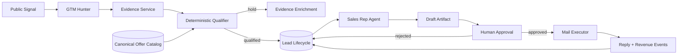

# Reference Architecture: Governed Revenue Funnel

A mixed-actor workflow that turns public demand signals into operator-approved
outreach and measurable outcomes without allowing an agent to invent evidence
or commit external actions.

## Architecture



## Actors and Authority

| Position | Actor | Authority |
| --- | --- | --- |
| Scout | GTM hunter | Observe and propose leads |
| Evidence | Website audit | Produce diagnostics only |
| Qualifier | Deterministic router + catalog | Score, route, or hold |
| Rep | Drafting agent | Prepare drafts only |
| Sovereign | Human operator | Approve exact commitment |
| Executor | Mail service | Commit with valid approval token |
| Observer | Reply and revenue ingestion | Record outcomes |

## Orthogonal State

```text
commercial: new -> qualified -> discovery -> proposal -> won/lost
communication: not_drafted -> drafted -> approved -> sent -> replied
                                                    \-> opted_out
```

The two state machines prevent “qualified” from being mistaken for “permission
to contact.”

## Evidence Gate

Draft eligibility requires:

- real company and website;
- named contact;
- verified recent signal URL;
- grounded current offer;
- no protected communication state.

Missing evidence returns `hold` plus the next enrichment action. The model does
not infer names or email addresses.

## Commitment Gate

The rep creates a draft but cannot approve or send it. Approval binds the exact
draft artifact; the mail executor refuses modified or already-used approvals.

## Two-Score Model

Keep opportunity and readiness separate:

- Technical opportunity score: observable problem magnitude.
- Sales qualification score: evidence, buyer fit, contact completeness, and
  grounded offer fit.

A high opportunity score can coexist with blocked outreach.

## Patterns Used

- Governed Actor Primitives
- Work-Item Lifecycle
- Authority-Aware Routing
- Evidence Gates
- Commitment Gates
- Workflow Evaluation
- Existing Shared Context and Evaluation patterns where multiple reasoning
  agents collaborate

## Generalization

Replace “lead” with deployment, procurement request, support case, payment
exception, or compliance finding. The same structure applies whenever an agent
prepares work that a governed actor must approve before external commitment.
