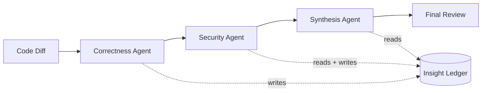
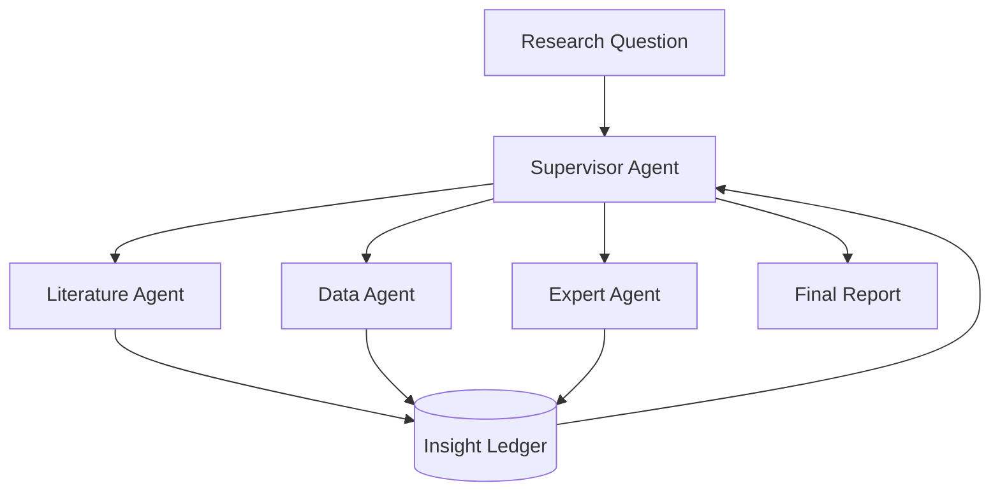
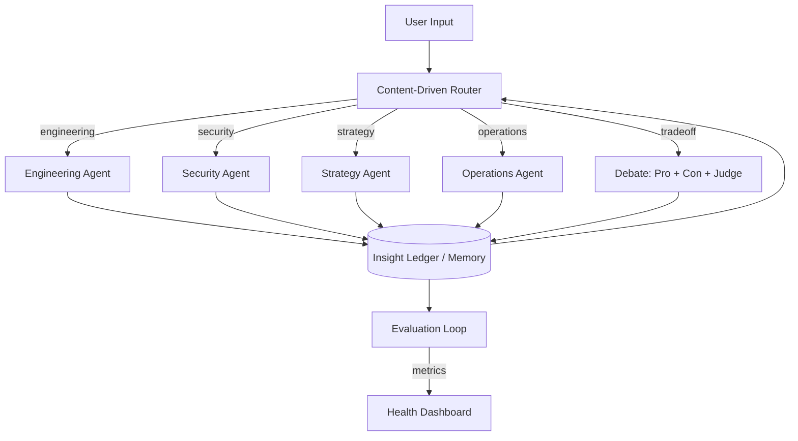

# Reference Architectures

Three concrete examples showing how MCPA patterns compose into real systems. Each architecture solves a different coordination problem.

---

## Code Review Pipeline

**3 agents, sequential + shared context**

A code review system where specialized agents each examine a diff from their own perspective, building on each other's findings.

### Architecture



### Agents

| Agent | Role | Sees |
|-------|------|------|
| **Correctness** | Logic bugs, edge cases, type errors, test gaps | The diff |
| **Security** | Injection, auth bypass, secrets, OWASP top 10 | The diff + Correctness findings |
| **Synthesis** | Merges findings, deduplicates, assigns severity | Ledger only (no diff) |

### Patterns used

- **Sequential Pipeline** (Coordination): Correctness → Security → Synthesis
- **Insight Ledger** (Shared Context): Each agent records findings with confidence and evidence
- **Context Briefing** (Shared Context): Security agent gets a briefing of correctness findings before starting
- **Routing Accuracy** (Evaluation): Track whether findings match human reviewer consensus

### Why this composition

Security findings depend on correctness findings. If the Correctness agent identifies dead code, the Security agent shouldn't waste time analyzing it. The sequential pipeline ensures Security has the full correctness picture before it starts.

The Synthesis agent doesn't see the diff — it only sees the ledger. This forces it to work from structured findings rather than re-reading code, which produces more consistent and concise reviews.

### Implementation sketch

```python
async def code_review_pipeline(diff: str) -> dict:
    ledger = InsightLedger()

    # Stage 1: Correctness
    correctness = await correctness_agent.run(diff)
    ledger.record("correctness", correctness.findings, correctness.confidence,
                  evidence=correctness.line_references, tags=["correctness"])

    # Stage 2: Security (with briefing from correctness)
    briefing = compose_briefing(ledger, security_agent)
    security = await security_agent.run(diff, briefing=briefing)
    ledger.record("security", security.findings, security.confidence,
                  evidence=security.line_references, tags=["security"])

    # Stage 3: Synthesis (ledger only, no diff)
    all_findings = ledger.current()
    synthesis = await synthesis_agent.run(
        f"Synthesize these code review findings into a final review:\n\n"
        f"{format_findings(all_findings)}\n\n"
        f"Deduplicate, assign severity (critical/high/medium/low), "
        f"and produce a PR comment."
    )

    return {
        "review": synthesis.output,
        "finding_count": len(all_findings),
        "critical_count": count_by_severity(all_findings, "critical"),
    }
```

---

## Research Desk

**4 agents, fan-out + shared context + supervisor**

A research system that investigates a question from multiple angles simultaneously, then synthesizes findings into a structured report.

### Architecture



### Agents

| Agent | Role | Tools |
|-------|------|-------|
| **Supervisor** | Decomposes question, delegates, assembles report | None (orchestration only) |
| **Literature** | Finds and summarizes existing research | Web search, paper search |
| **Data** | Finds and analyzes quantitative data | Data APIs, calculation tools |
| **Expert** | Provides domain expertise and identifies gaps | Domain knowledge (via system prompt) |

### Patterns used

- **Supervisor** (Coordination): Decomposes the question, monitors worker progress, assembles the report
- **Parallel Fan-Out** (Coordination): Literature, Data, and Expert agents work simultaneously
- **Insight Ledger** (Shared Context): All agents record findings with confidence and evidence
- **Progressive Context** (Shared Context): Supervisor can pull additional context for workers if they get stuck
- **CQS + CUR** (Evaluation): Is the multi-agent report better than a single-agent report? Is shared context being used?

### Why this composition

Research benefits from diverse perspectives working in parallel. Literature finds what's already known, Data finds what's measurable, Expert fills gaps with domain reasoning. The Supervisor manages the lifecycle because research is inherently unpredictable — a Data agent might hit a dead end and need reassignment.

The fan-out structure keeps total latency close to the slowest single agent rather than the sum of all three.

### Implementation sketch

```python
async def research_desk(question: str) -> dict:
    ledger = InsightLedger()

    # Supervisor decomposes the question
    plan = await supervisor.run(
        f"Decompose this research question into subtasks for:\n"
        f"- Literature agent (existing research)\n"
        f"- Data agent (quantitative evidence)\n"
        f"- Expert agent (domain reasoning)\n\n"
        f"Question: {question}"
    )

    # Fan out to all three agents in parallel
    results = await asyncio.gather(
        literature_agent.run(plan.literature_task),
        data_agent.run(plan.data_task),
        expert_agent.run(plan.expert_task),
    )

    # Record all findings
    for agent, result in zip(
        [literature_agent, data_agent, expert_agent], results
    ):
        ledger.record(agent.id, result.findings, result.confidence,
                      evidence=result.sources, tags=result.topics)

    # Check for gaps — supervisor may dispatch follow-up
    gaps = await supervisor.run(
        f"Review these findings and identify critical gaps:\n\n"
        f"{format_ledger(ledger)}"
    )

    if gaps.has_critical_gaps:
        # Dispatch follow-up to the most relevant agent
        followup = await dispatch_followup(gaps, ledger)

    # Assemble final report
    report = await supervisor.run(
        f"Assemble a research report from these findings:\n\n"
        f"{format_ledger(ledger)}\n\n"
        f"Structure: Key Findings, Evidence, Patterns, Gaps, Recommendations"
    )

    return {"report": report.output, "sources": ledger.current()}
```

---

## Cognitive Kernel

**5+ agents, router + shared context + debate + evaluation**

A persistent agent system that handles diverse tasks by routing to specialized agents, using debate for high-stakes decisions, and maintaining shared memory across sessions.

### Architecture



### Agents

| Agent | Domain | Activation signal |
|-------|--------|------------------|
| **Router** | Task analysis + dispatch | Every input |
| **Engineering** | Code, architecture, technical decisions | Technical content detected |
| **Security** | Auth, vulnerabilities, compliance | Security keywords, production mentions |
| **Strategy** | Business decisions, prioritization, tradeoffs | Strategic questions, resource allocation |
| **Operations** | Process, deployment, monitoring | Ops keywords, status requests |
| **Debate (Pro+Con+Judge)** | Genuine tradeoffs | Router detects no clear right answer |

### Patterns used

- **Content-Driven Router** (Routing): Analyzes input for entities, intent, risk — not just topic
- **Insight Ledger** (Shared Context): Persistent across sessions via database-backed memory
- **Context Briefing** (Shared Context): Each agent gets filtered, relevant prior findings
- **Context Decay** (Shared Context): Old insights decay in confidence; periodic consolidation
- **Debate** (Coordination): Activated for tradeoff decisions (build vs. buy, monorepo vs. polyrepo)
- **All 5 metrics** (Evaluation): Continuous monitoring of system health

### Why this composition

A persistent system faces challenges that one-shot systems don't: context accumulates indefinitely, routing accuracy drifts as the system's domain expands, and agents can become stale. The evaluation loop catches these regressions.

Content-driven routing handles the ambiguity of real user input better than topic classification. The debate pattern activates only for genuine tradeoffs — most tasks go to a single agent.

The shared memory (persistent ledger) means agents in session 50 can reference insights from session 1, with confidence-decayed appropriately.

### What makes this architecture work

1. **The router is cheap.** A single LLM call that extracts signals and applies rules. It doesn't try to do the agent's job — just dispatch.

2. **Agents are narrow.** Each agent has a tight domain. They're good at one thing. The router composition creates breadth.

3. **Context is curated.** The briefing layer filters aggressively. An engineering agent doesn't see strategy insights unless they're tagged as relevant.

4. **The debate escape hatch.** When the router detects a genuine tradeoff (no single agent can answer it), it activates the debate pattern instead of forcing one agent to handle something outside its competency.

5. **Evaluation closes the loop.** Monthly CQS benchmarks confirm the system is still producing coordination value. If CQS drops below 1.0, agents get reviewed and simplified.

---

## Applying These Architectures

These are starting points, not blueprints. When building your own:

1. **Start with one agent.** Add a second only when you can articulate what the first can't do.
2. **Add routing before adding agents.** The router is the most valuable piece — it determines whether your system works.
3. **Measure CQS early.** If 2 agents aren't measurably better than 1, don't add a third.
4. **Shared context is optional.** If agents don't need each other's findings, skip the ledger. Unnecessary coordination is waste.
5. **Debate is expensive.** Reserve it for decisions that genuinely have two defensible sides. Don't debate obvious questions.
